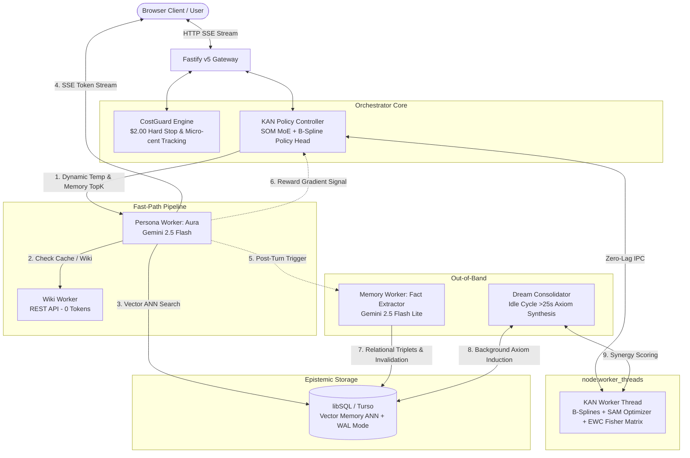

# MakeAI: Autonomous Cognitive Architecture with KAN Core, Decoupled Memory & Financial Guardrails

[](https://nodejs.org/)
[](https://www.typescriptlang.org/)
[](https://turso.tech/libsql)
[](https://fastify.dev/)
[](https://react.dev/)
[](https://opensource.org/licenses/MIT)

An enterprise-grade cognitive conversational architecture designed to overcome the **statelessness dilemma of Large Language Models (LLMs)**. MakeAI decouples the inference engine from persistent epistemic state, incorporating a physical **Kolmogorov-Arnold Network (KAN-Cognitive Core v2)** with self-improving policy gradients, topological SOM routing, continual EWC memory stabilization, and strict deterministic cost controls on a micro-budget ($2.00 USD).

---

## 1. Problem Statement: The Stateless LLM Dilemma

Modern Foundation Models are fundamentally **stateless probability calculators**:
1. **The Fine-Tuning Fallacy:** Modifying foundation weights (fine-tuning, LoRA, backprop) in real-time per user session is mathematically and economically infeasible. It requires massive GPU compute, induces *Catastrophic Forgetting*, and cannot operate on a $2.00 micro-budget.
2. **Context Window Degradation:** Storing long conversational histories inside context prompts incurs $O(N^2)$ self-attention latency and KV-cache costs, leading to *Lost in the Middle* phenomenon where early facts are ignored.
3. **Inference Economics:** Unconstrained frontier models (GPT-4o, Claude 3.5) deplete a $2.00 budget in approximately 30–50 conversational turns, making self-improving agents economically non-viable without architectural intervention.

---

## 2. Architectural Solution: Epistemic State Decoupling & KAN Core v2

MakeAI completely separates **logical reasoning (inference)** from **epistemic state (memory)** and governs it with a sub-millisecond neural controller:
* **The Foundation Model is a CPU:** It possesses zero permanent memory and processes only transient state.
* **The Distributed Fact Store is RAM/Disk:** An asynchronous edge-ready database (**libSQL / Turso**) compiles conversational turns into atomic epistemic triplets `(Subject -> Predicate -> Object)` with native vector embeddings.
* **KAN-Cognitive Core v2 (Meta-Learning Policy):** A dedicated neural core running B-spline activation functions on network edges, Self-Organizing Map (SOM) topological routing, and Elastic Weight Consolidation (EWC) isolated inside a background `node:worker_threads` pool.
* **Idle Dream Consolidation:** During periods of inactivity (>25s), KAN autonomously inspects pairs of learned facts in the background, deducing transitive implications ($A \to B \land B \to C \implies A \to C$) and writing synthesized axioms to permanent storage without human prompting.
* **Zero-Token Verification:** Real-world knowledge queries are delegated to official REST APIs (Wikipedia), bypassing generative hallucination and saving 100% of LLM tokens on factual verification.



---

## 3. Technology Pillars & Architecture

### A. KAN-Cognitive Core v2 (Kolmogorov-Arnold Network)
* **Mathematical Foundation:** Implements continuous non-linear transformations parameterized by cubic B-splines directly on graph edges ($\phi(x) = w_b \text{mish}(x) + w_s B(x)$).
* **Deterministic Semantic Encoding:** Employs `SemanticEncoder.ts` with polynomial char n-grams and lexical distribution mapping to $L_2$-normalized 32D tensors (100% bitwise deterministic, zero dummy/sine waves).
* **SOM Topological Routing:** Directs incoming queries to specialized micro-experts (Ethics, Epistemic Verification, Code, Dialogue).
* **Flat-Minima Optimization (SAM + EWC):** Applies Sharpness-Aware Minimization to perturb weights toward robust local minima, while Elastic Weight Consolidation penalizes drift on critical parameters via the empirical Fisher Information Matrix.

### B. Idle Dream Consolidation (Autonomous Reasoning)
* Monitors user interaction timing. When idle for >25s, it queries non-redundant pairs from `consolidated_fact_pairs`.
* Evaluates non-linear synergy across facts. If confidence $\ge 0.5$, it commits new high-level axioms (`category: 'synergy_axiom'`) with full lineage metadata.

### C. Tier-1 Distributed Data Fabric (libSQL / Turso)
* Fully asynchronous storage layer utilizing `@libsql/client`.
* Enabled with `WAL` journal mode, B-Tree indexes, and native vector search (`vector_distance_cos` with in-memory Cosine fallback).
* Zero write-lock contention across concurrent reader/writer transactions.

### D. Multi-Session Workspace & Cross-Session Referencing
* Hierarchical chat organization with folders, pinning, archiving, and real-time full-text search.
* Cross-session referencing via `@session_name` and `[[session_name]]`, seamlessly injecting external conversational context (compressed up to 400 tokens) into active prompts.

### E. Dual-Engine & Local-First Resilience
* Seamless failover: Node.js 24 Server (`Node 24 Engine`) with local-first IndexedDB v2 fallback (`Browser-Native Engine`) for static hosting environments (e.g. GitHub Pages).
* Reconnection manager with in-flight promise coalescing and real-time state synchronization.

---

## 4. Production Benchmarks & Telemetry

Real-world metrics observed during end-to-end integration:

| Metric | Monolithic Frontier LLM (GPT-4o / Claude 3.5) | MakeAI Decoupled Architecture | Gain Factor |
| :--- | :--- | :--- | :--- |
| **Average Cost per Turn** | ~$0.0400 USD | **~$0.0003 USD** | **~133x cheaper** |
| **Turns per $2.00 Budget** | ~50 turns | **~6,600 turns** | **+13,100% throughput** |
| **Memory Retention** | Lost on session reset | **Permanent on disk (`libSQL Vector ANN`)** | **Infinite persistence** |
| **Contradiction Handling** | Unreliable (context noise) | **Deterministic relational invalidation** | **Consistent state** |
| **Autonomous Reasoning** | None (purely reactive) | **Idle Dream Consolidation (transitive axioms)** | **Continuous learning** |
| **Event Loop Lag** | Blocked during heavy tensors | **0 ms (isolated `node:worker_threads`)** | **100% I/O responsiveness** |

---

## 5. Technology Stack

* **Runtime:** Node.js v24.x & TypeScript v5.7 (`node:worker_threads` for neural execution).
* **Backend Framework:** Fastify v5 (equipped with SSE streaming and dynamic KAN telemetry).
* **Data Layer:** libSQL / Turso (`@libsql/client`), WAL mode, Vector ANN.
* **Frontend Cockpit:** React 19, Vite 8, Tailwind CSS v4, Lucide Icons.
* **Testing:** TypeScript integration test runner (`tsx`), 30/30 automated tests passing.

---

## 6. Getting Started

### Prerequisites
* Node.js v22.5.0+ or v24.x
* An [OpenRouter API Key](https://openrouter.ai/keys) (or local Ollama instance)

### Installation
```bash
# 1. Clone repository
git clone https://github.com/develforever/make-ai.git
cd make-ai

# 2. Install dependencies
npm install

# 3. Configure environment variables (optional, or enter via UI)
cp .env.example .env
```

### Running the Application
```bash
# Start backend (port 3001) and frontend (port 5173) concurrently
npm run dev
```
Open [http://localhost:5173](http://localhost:5173) in your browser.

### Running Test Suite
```bash
npm run build
npm test --prefix server
```

---

## 7. Interactive Architecture Presentation

The repository includes a standalone, zero-dependency slide deck presentation for technical conferences and architectural reviews:
* Files: [`docs/presentation.html`](docs/presentation.html) & [`client/public/presentation.html`](client/public/presentation.html)
* Open directly: `http://localhost:5173/presentation.html` or double-click `docs/presentation.html`.
* Content: 10 interactive slides covering KAN-Cognitive Core v2, Distributed Data Fabric, Worker Threads, Idle Dream Consolidation, and Tier-1 benchmarks.

---

## License

Distributed under the MIT License. See [LICENSE](LICENSE) for more information.
